[README.md](https://github.com/user-attachments/files/32577574/README.md)
<!-- ═══════════════════════════════════════════════════════════
     J.A.R.V.I.S. // PERFIL GITHUB — alves-dev1
     Repositório: alves-dev1/alves-dev1 (branch main)
     ═══════════════════════════════════════════════════════════ -->

<div align="center">



<a href="https://git.io/typing-svg">
  
</a>

<br/>


</div>


<br/>

## `> whoami`

<table>
<tr>
<td width="62%" valign="top">

```yaml
identidade:
  nome: Enzo
  usuario: alves-dev1
  base: São Paulo, Brasil 🇧🇷
  formacao: Desenvolvimento de Sistemas — Etec
  classe: Desenvolvedor Web Full Stack (em evolução)
  missao: Transformar ideias em produtos que funcionam
  status: 🟢 Online e aprendendo
```

</td>
<td width="38%" valign="top">

**⚡ Resumo do sistema**

- 🎓 Estudante de **Desenvolvimento de Sistemas** na Etec
- 🛒 Construo **e-commerces e catálogos** para clientes reais
- 🧠 Estudo fundamentos: algoritmos, HTTP, SQL, Git e DevOps
- 🚀 Foco em entregar, publicar e melhorar

</td>
</tr>
</table>

> 💬 *"Código bom é o que resolve o problema de alguém de verdade."*

<br/>

## `> stack --list`

<div align="center">

**// LINGUAGENS & BANCO DE DADOS**


<br/><br/>

**// FERRAMENTAS & PLATAFORMAS**


<br/><br/>


</div>

### 🛠️ Arsenal de ferramentas

<div align="center">

| 🧩 Módulo | ⚙️ Tecnologia | 🎯 Uso |
|:--|:--|:--|
| **Versionamento** |   | Controle de versão e portfólio |
| **Deploy** |  | Publicação de sites |
| **Mídia** |  | Hospedagem de imagens de produtos |
| **Dados** |  | Catálogo dinâmico de produtos |
| **Checkout** |  | Finalização de pedidos |
| **Editor** |  | Ambiente de desenvolvimento |
| **IA** |  | Pair programming e estudo |

</div>

<br/>

## `> projetos --featured`

<div align="center">
<table>
<tr>

<td width="33%" valign="top">

### 🏋️ Braba Store
<sub>`E-COMMERCE · MODA FITNESS`</sub>

Catálogo online com carrinho, variações de cor, seletor de tamanhos e checkout via WhatsApp. Produtos alimentados por planilha.


🔗 [**usebrabastore.com.br**](https://usebrabastore.com.br)

</td>

<td width="33%" valign="top">

### 💎 Cá Santos
<sub>`E-COMMERCE · SEMIJOIAS`</sub>

Site de catálogo para loja de joias do Instagram, com vitrine de produtos e pedido direto pelo WhatsApp.


🟢 **Projeto entregue**

</td>

<!-- <td width="33%" valign="top">

### ✨ S Shine Store
<sub>`E-COMMERCE · EM DESENVOLVIMENTO`</sub>

Novo site para a loja do Instagram **@use.sshinestore**, seguindo o mesmo modelo validado no Braba Store.


🛠️ **Compilando...**

</td> -->

</tr>
</table>
</div>

<div align="center">
<sub>📌 Mais projetos em breve — acompanhe meus <a href="https://github.com/alves-dev1?tab=repositories">repositórios</a>.</sub>
</div>

<br/>

## `> objetivos --current`

```bash
enzo@jarvis:~$ cat objetivos.log

[✔] Publicar sites reais para clientes (Braba Store, Cá Santos)
[▶] Finalizar o site da S Shine Store ........................ 70%
[▶] Aprofundar PHP + MySQL em aplicações completas ........... 55%
[▶] Dominar C# e conceitos de POO ............................ 40%
[▶] Estudar Git a fundo, cloud e DevOps ...................... 30%
[○] Construir um portfólio de projetos open source
[○] Conquistar a primeira vaga como desenvolvedor

enzo@jarvis:~$ status --now
> Aprendendo... Codando... Evoluindo...  ⚡
enzo@jarvis:~$ █
```

<br/>

## `> stats --github`

<div align="center">


<br/>


<br/><br/>


</div>

<br/>

## `> trophies --show`

<div align="center">


</div>

<br/>

## `> contributions --snake`

<div align="center">

<picture>
  <source media="(prefers-color-scheme: dark)" srcset="https://raw.githubusercontent.com/alves-dev1/alves-dev1/output/github-snake-dark.svg" />
  <source media="(prefers-color-scheme: light)" srcset="https://raw.githubusercontent.com/alves-dev1/alves-dev1/output/github-snake.svg" />
  
</picture>

</div>

<br/>

## `> connect --social`

<div align="center">

<a href="https://github.com/alves-dev1"></a>
<a href="https://www.linkedin.com/in/SEU-LINKEDIN/"></a>
<a href="https://www.instagram.com/SEU-INSTAGRAM/"></a>
<a href="mailto:SEU-EMAIL@exemplo.com"></a>
<a href="https://wa.me/55SEUNUMERO"></a>

</div>

<br/>


<div align="center">

```text
┌──────────────────────────────────────────────────┐
│  SISTEMA: J.A.R.V.I.S.  //  STATUS: ONLINE  ⚡    │
│  "Aprender, construir, publicar. Repetir."       │
└──────────────────────────────────────────────────┘
```


</div>
